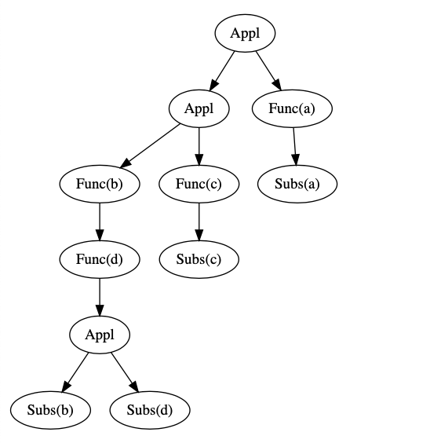
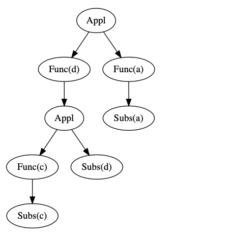
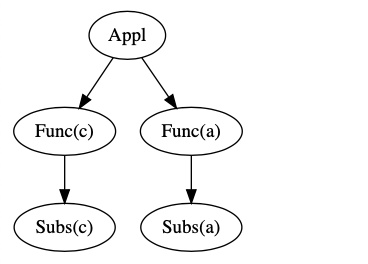
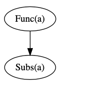

# datastruct-final-project
PPKE ITK Data structures class final project

# Task: 

Take the following special tree structure:

There are three types of nodes: Func, Appl, and Subs.
Each Func node has one child and has a label.
Each Appl node has two children.
Each Subs node has a label and no child.
Each Subs node has an (Func) ancestor (not necessarily direct) that has the same tag.
For example:

To simplify (or evaluate) the tree, we must resolve all Appl nodes. An Appl node is unlocked as follows:

If the left-hand child is not a Func node, it can not be unlocked.
Otherwise, we read the left node label, say x, then in the left part subfolder all Subs (x) nodes are replaced at the right subfolder of the Appl node.
We delete Appl, the right subfold and the left child.
During the evaluation, it is always advisable to release the top appl. Good example:

The top Appl can not be unlocked because its left side does not have a Func node. We can, however, solve the nested node:

Thus, the top application can be unlocked:

Finally, the last application:

